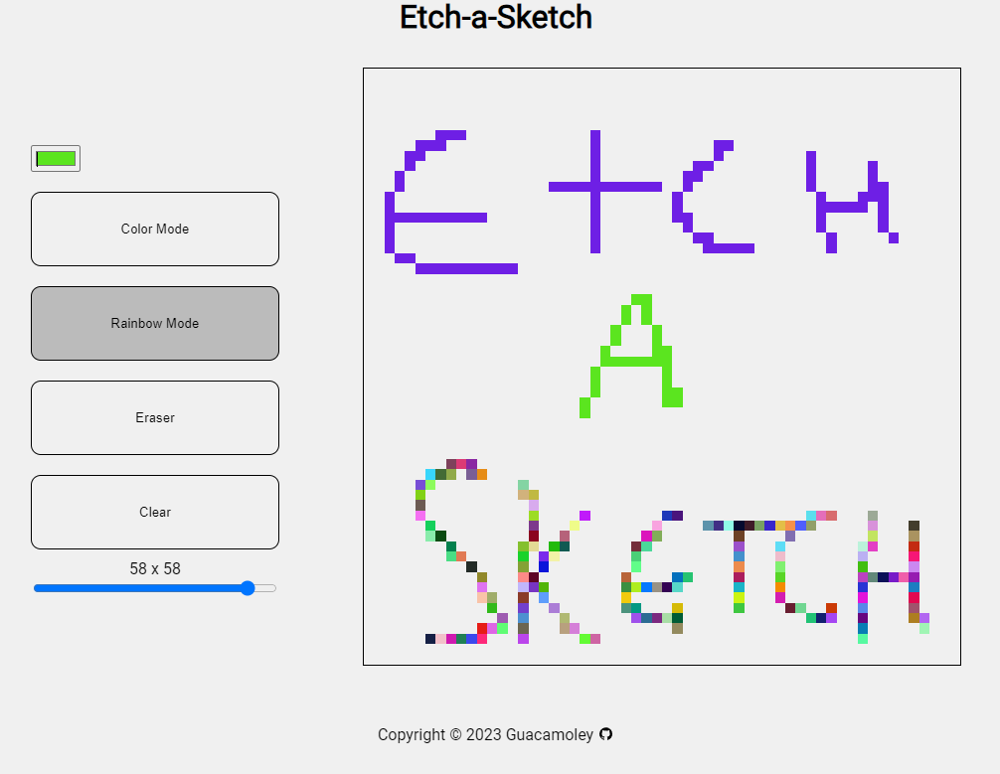

# Etch-a-Sketch Project

This Etch-a-Sketch project is part of The Odin Project's curriculum, designed to help you learn web development through hands-on experience. With this project, you can create a digital drawing application reminiscent of the classic Etch-a-Sketch toy.

## Features

To try out the project, you can access the live version at [LINK]([https://guacamoley.github.io/calculator/](https://guacamoley.github.io/etch-a-sketch/)).

- Draw on the canvas using your mouse cursor.
- Choose from various colors.
- Rainbow brush color.
- Grid resizing.
- Clear the canvas to start a new drawing.
- Have fun and get creative!

## Getting Started

1. Clone this repository to your local machine.
2. Open the `index.html` file in your web browser.
3. Start drawing and enjoy your Etch-a-Sketch experience!

## Project Structure

- `index.html`: The main HTML file for the project.
- `style.css`: The CSS file for styling the Etch-a-Sketch.
- `etchasketch.js`: The JavaScript file containing the drawing functionality.
- `resources/`: Folder for storing project images (if any).

## Contributing

Contributions are welcome! Feel free to fork this project, make improvements, and submit pull requests.

## License

This project is licensed under the [Do What The F\*ck You Want To Public License (WTFPL)](LICENSE). You are free to do whatever the f\*ck you want with this code.

---

**Happy Drawing!** 🎨
